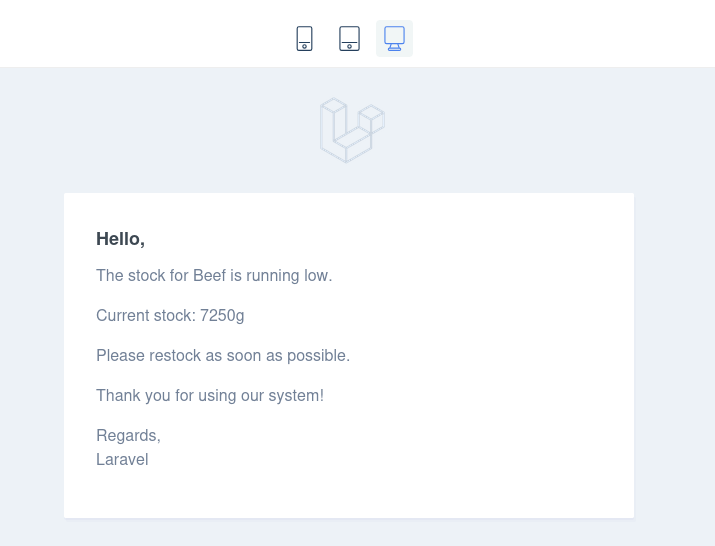
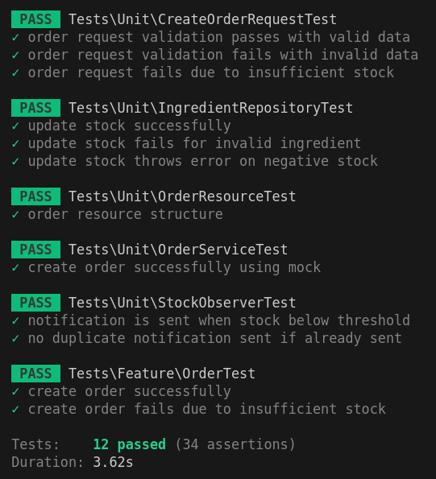

# Inventory and Order Management System

The goal of this system is to manage inventory levels for ingredients and process customer orders while ensuring proper notifications are sent when stock levels are low. The system handles three main models: Product, Ingredient, and Order.

## Features

- A product (e.g., Burger) is composed of multiple ingredients.
- The system tracks ingredient stock levels in the database.
- Automatic stock deduction when an order is placed.
- Sends an email notification to the merchant when any ingredient stock reaches 50%.
- Ensures only one email notification is sent per ingredient below 50%.
- Comprehensive testing to validate order storage and stock updates.

### Example Data

#### Product:
- **Burger**
  - 150g Beef
  - 30g Cheese
  - 20g Onion

#### Initial Stock Levels:
- Beef: 20kg
- Cheese: 5kg
- Onion: 1kg

#### Order Payload Example:
```json
{
  "products": [
    {
      "product_id": 1,
      "quantity": 2
    }
  ]
}
```

## Specifications

- Backend Implementation in PHP v8.2, Laravel v^11.31, and MySQL v8.0.32.
- Docker setup using [sail](https://laravel.com/docs/11.x/sail#introduction) to containerize the application.
- Auto-generated Postman collection to test all APIs using [laravel-api-to-postman](https://github.com/andreaselia/laravel-api-to-postman).

## Installation and Setup

Clone the repository:
```bash
git clone git@github.com:FatmaSaad/inventory-order-system.git
```

Switch to the repository folder:
```bash
cd inventory-order-system
```

Install dependencies using Composer:
```bash
composer install
```

Copy the example environment file:
```bash
cp .env.example .env
```

Generate the application key:
```bash
php artisan key:generate
```

Run database migrations and seed initial data:
```bash
php artisan migrate --seed
```

Start the local development server:
```bash
php artisan serve
```

You can now access the server at [http://localhost:8000](http://localhost:8000).

### Docker Setup

Use Laravel Sail to containerize the application. Ensure Docker is installed and running.

Start the containers:
```bash
sail up
```

Run migrations and seeders:
```bash
sail artisan migrate --seed
```

Access the application using the container’s server address.

### Testing

Run all unit tests:
```bash
vendor/bin/phpunit --testdox
```

```bash
 sail test
```

### API Endpoints

1. **Create Order:**
   - Endpoint: `POST /api/orders`
   - Payload Example:
     ```json
     {
       "products": [
         {
           "product_id": 1,
           "quantity": 2
         }
       ]
     }
     ```
   - Functionality: Persists the order, deducts stock, and sends email if necessary.

2. **Check Stock Levels:**
   - Endpoint: `GET /api/ingredients`
   - Functionality: Returns current stock levels for all ingredients.

### Notifications

- **Trigger:** When any ingredient stock level drops below 50%.
- **Medium:** Email notification (integrated with [Mailtrap](https://mailtrap.io) for development).
- **Scheduler:**
  ```bash
  php artisan schedule:work
  ```
  ```bash
    sail artisan schedule:work
    ```

Run manually for testing:
```bash
php artisan app:send-low-stock-notifications
```

### Example Email Notification
**Subject:** Low Stock Alert for Beef
**Body:** The stock for Beef has dropped below 50%. Please restock soon.

---

## Development Notes

- Ensure correct database configuration in the `.env` file before running migrations.
- Use `php artisan migrate:refresh` to reset the database during development.

## Screenshots

- **Email Notification Example:**

  


- **Test Results:**

  

